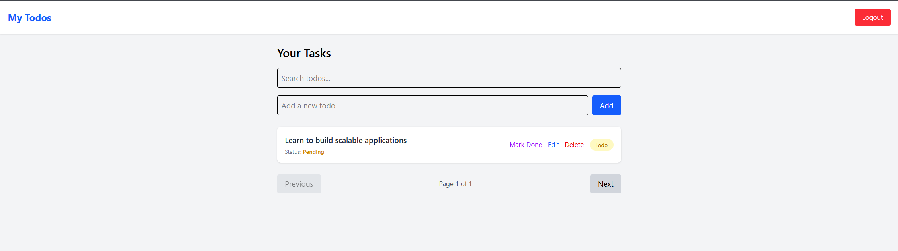

JWT Auth Todo App (MERN Stack)

📖 Overview

This is a full-stack Todo application built using React, Node.js, Express, MongoDB, and JWT authentication.
Users can sign up, log in, and manage their own todos with full CRUD functionality, search, pagination, and a clean UI.

Each user’s data is protected using JWT-based authentication.

✨ Features
🔐 Authentication

User Signup & Login

JWT Token-based authentication

Password hashing with bcrypt

Show/Hide password toggle

Protected routes

📝 Todo Management

Create Todos

Edit Todos (inline)

Delete Todos

Mark as Completed / Pending

Search Todos

Pagination

User-specific todos only

🎨 UI

Clean Tailwind CSS design

Responsive layout

Login ↔ Signup switching

Logout functionality

🛠 Tech Stack
Frontend

React (Vite)

Tailwind CSS

Fetch API

Backend

Node.js

Express.js

MongoDB + Mongoose

JWT (jsonwebtoken)

bcrypt

Setup Instructions
1️⃣ Clone the Repository
git clone https://github.com/your-username/todo-jwt-app.git
cd todo-jwt-app

2️⃣ Backend Setup
cd server
npm install

Create a .env file:

PORT=3000
MONGO_URI=your_mongodb_url
JWT_SECRET=your_secret_key

Start the backend:

npm run dev

3️⃣ Frontend Setup
cd client
npm install
npm run dev

🔑 API Endpoints
Auth

POST /api/auth/signup

POST /api/auth/login

Todos

GET /api/todos

POST /api/todos

PUT /api/todos/:id

DELETE /api/todos/:id

(All Todo routes require JWT token)

🧪 Example Login Credentials

You can create your own account using the Signup page.

